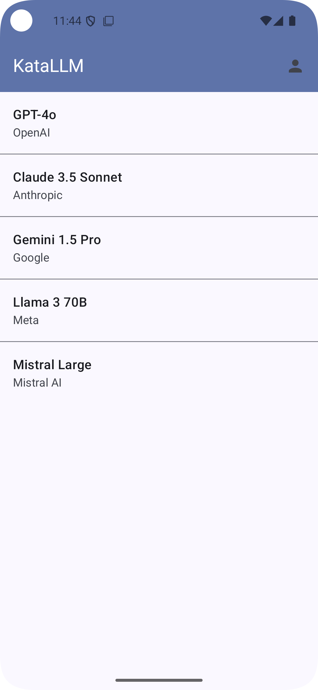
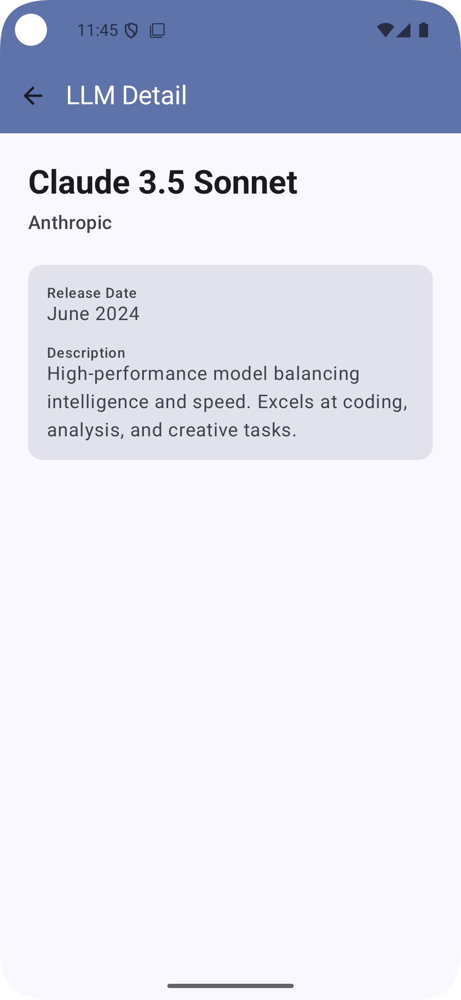

# KataLLMAndroid

Android App that shows a list of LLMs, managed using Claude Code and GitHub

| LLM List | LLM Detail |
|:---:|:---:|
|  |  |

## Architecture Overview

This application follows **MVVM/MVI architecture patterns** with a clean, layered design optimized for Jetpack Compose. The app demonstrates modern Android development best practices using reactive programming and dependency injection.

### Architecture Layers

```
┌─────────────────────────────────────┐
│         UI Layer (Compose)          │
│  Activity / Screen Composables      │
└────────────────┬────────────────────┘
                 │ observes
┌────────────────▼────────────────────┐
│         ViewModel Layer             │
│  State management & business logic  │
└────────────────┬────────────────────┘
                 │ calls
┌────────────────▼────────────────────┐
│  Repository / UseCase Layer         │
│  Business logic orchestration       │
└────────────────┬────────────────────┘
                 │ accesses
┌────────────────▼────────────────────┐
│    Data Sources (Network, Local)    │
│  Retrofit, Room, Shared Preferences │
└─────────────────────────────────────┘
```

### State Propagation to UI

The app uses **Flow** and **StateFlow** for reactive state management:

1. **Data Sources** return `Flow<T>` from network or local storage
2. **Repositories/UseCases** process and transform data streams using Flow operators
3. **ViewModels** expose UI state as `StateFlow<UiState>` to Compose
4. **Compose** observes StateFlow using `collectAsStateWithLifecycle()`
5. State changes trigger **automatic recomposition** of affected Composables

Example flow:
```kotlin
// Data Source: Returns Flow
fun getLlms(): Flow<List<Llm>> = flow { emit(apiCall()) }

// Repository: Transforms the flow
fun fetchLlms(): Flow<List<Llm>> = llmDataSource.getLlms()

// ViewModel: Manages UI state
val llmState: StateFlow<UiState> = llmRepository.fetchLlms()
  .map { UiState.Success(it) }
  .stateIn(viewModelScope, SharingStarted.Lazily, UiState.Loading)

// Screen: Observes and recomposes
@Composable
fun LlmListScreen(viewModel: LlmListViewModel) {
  val state by viewModel.llmState.collectAsStateWithLifecycle()
  // UI automatically recomposes when state changes
}
```

## Technology Stack

| Component | Technology | Purpose |
|-----------|-----------|---------|
| **Language** | Kotlin 2.0.21 | Modern, concise, null-safe Android development |
| **UI Framework** | Jetpack Compose with Material3 | Declarative UI with modern Material Design |
| **State Management** | StateFlow + Flow | Reactive, lifecycle-aware state propagation |
| **Concurrency** | kotlinx.coroutines | Async operations, lifecycle-aware |
| **Dependency Injection** | Hilt | Constructor injection, scoped dependencies |
| **Networking** | Retrofit + OkHttp | Type-safe REST API client with interceptors |
| **JSON Parsing** | Gson | Automatic serialization/deserialization |
| **Build System** | Gradle with Kotlin DSL | Organized builds with Version Catalog |
| **Min/Target SDK** | 33 / 35 (Android 13 / 14) | Modern Android APIs, backward compatibility |

## Key Architectural Decisions

### No Unnecessary Abstraction
- Repositories are concrete classes, not interfaces (no single-implementation interfaces)
- UseCases are only added when they contain complex logic
- ViewModels call repositories directly for simple operations

### All Async Operations Use Flow
- Every data source returns `Flow<T>`
- Flow enables composition, cancellation, and lifecycle management
- Lazy evaluation reduces unnecessary network calls

### Material Design 3 & Standard Components
- Using built-in Material3 Composables for consistency
- Standard Android components prioritized over custom implementations
- Single-module architecture (may modularize by feature/layer in future)

### ViewModel Unit Tests
- Every ViewModel has associated unit tests
- Tests verify collaborations between ViewModel and external dependencies
- Flow collection and coroutine behavior tested with proper test dispatchers

## Project Structure

```
app/
├── src/main/kotlin/es/voghdev/katallmandroid/
│   ├── MainActivity.kt                 # Entry point
│   ├── ui/
│   │   ├── screens/                   # Composable screens
│   │   └── theme/                     # Material3 theme configuration
│   ├── viewmodel/                     # MVVM ViewModels with StateFlow
│   ├── repository/                    # Data layer repositories
│   ├── datasource/                    # Network/local data sources
│   └── domain/                        # Data models
├── gradle/libs.versions.toml          # Centralized dependency management
└── build.gradle.kts                   # Gradle configuration
```

## Getting Started

```bash
# Build the project
./gradlew build

# Run tests
./gradlew test

# Install on device/emulator
./gradlew installDebug
```

See CLAUDE.md for detailed build commands and development guidelines.
